# Quiz LMS

[](https://github.com/Gestusition/Quiz-LMS/actions/workflows/nodejs.yml)
Quiz LMS is a full-stack course and quiz management system built for the System Analysis and Design CRUD project requirements. It uses a vanilla JavaScript single-page frontend, an Express REST API, and SQLite databases with a layered backend structure.

The project is intentionally backend-heavy: routes stay thin, business rules live in services, SQL lives in repositories, and tests exercise the academic workflows instead of only checking that pages render.

## Requirement Coverage

- Vanilla JavaScript SPA: `public/index.html` and `public/js/` use browser modules and `fetch`, with no React/Vue/Angular.
- Node.js + Express backend: `server.js` mounts the REST API and static SPA.
- Database-backed CRUD: SQLite stores users, courses, categories, questions, quizzes, attempts, enrollments, academic records, audit logs, settings, and more.
- REST/JSON API: endpoints use standard HTTP methods and JSON request/response bodies.
- Validation: backend validators and service checks protect academic identifiers, question formats, quiz settings, uploads, passwords, and scoped access rules.
- Modular code quality: `routes -> services -> repositories`, plus `validators`, `serializers`, `constants`, and middleware.
- Swagger: admin-only interactive API documentation is available at `http://localhost:3000/api-docs`.
- Tests: Jest covers auth, maintenance mode, quiz attempts, academic workflows, validators, rate limiting, route mounts, and LMS regressions.

## Main Features

- Role-based accounts for `admin`, `teacher`, and `student`.
- Strict academic login identifiers:
  - admins log in with `username` or `email`
  - teachers log in with `email`
  - students log in with `student_number`
- Maintenance mode for fresh installs and controlled rollout.
- Admin user management with search, filtering, pagination, duplicate protection, profile data, and password reset codes.
- Course, offering, enrollment, term, faculty, department, class year, and section management.
- Question bank with categories, difficulty, multiple question types, math/table questions, image upload, validation issues, and sharing controls.
- Quiz lifecycle with drafts, publishing, timed attempts, max attempts, result visibility policies, negative marking, manual review, templates, grade schemes, and SEB-compatible checks.
- Assignment submission and grading workflows.
- Attendance sessions, self-attendance, instructor records, record removal notes, and summaries.
- Weekly course materials, protected resource downloads, and discussion threads.
- Teacher office hours: teachers set them from Profile, and enrolled students see them on course participant lists.
- User restrictions, scoped access blocking, audit logging, real CSV import batches, and admin analytics.

## Screenshots

| Admin dashboard | Teacher dashboard |
| --- | --- |
| 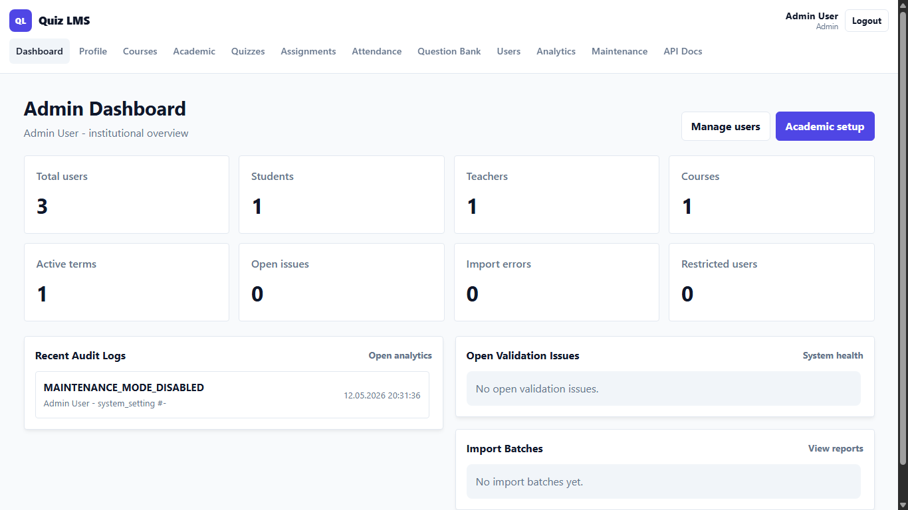 | 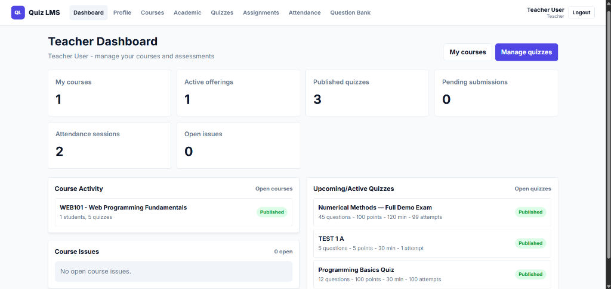 |

| Student dashboard | Course management |
| --- | --- |
| 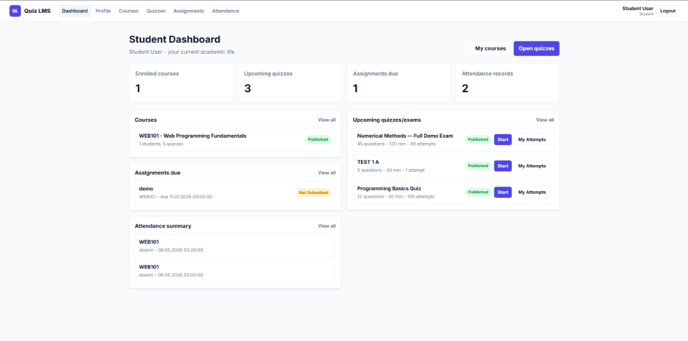 | 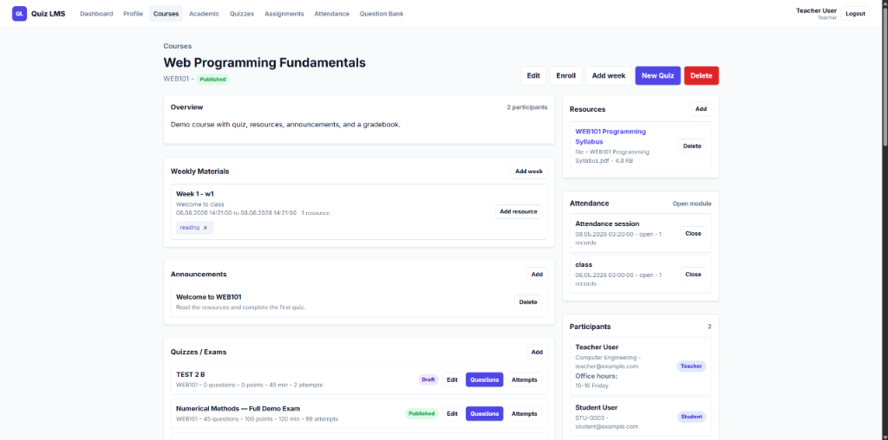 |

| Course detail | Edit quiz workflow |
| --- | --- |
| 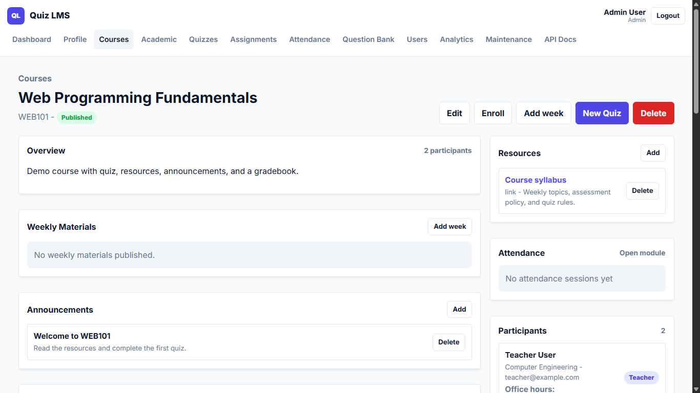 | 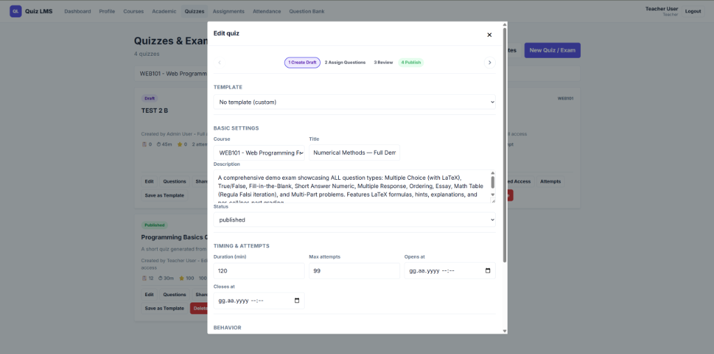 |

| Question bank | Quiz taking experience |
| --- | --- |
| 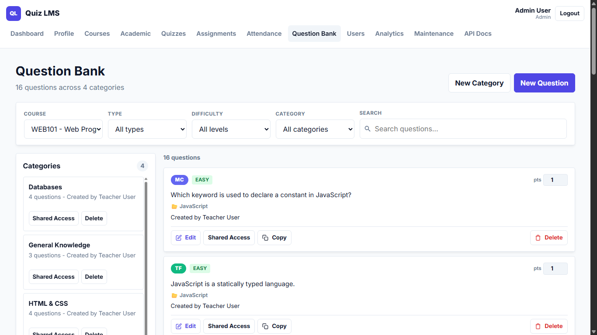 | 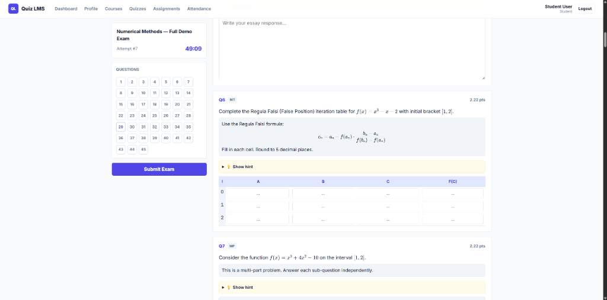 |

| Quiz attempt review | Quiz attempts list |
| --- | --- |
| 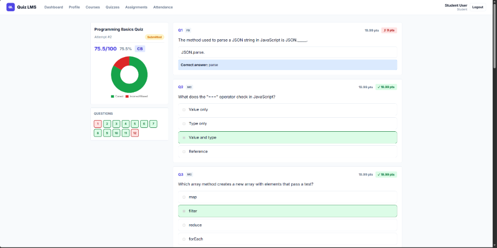 | 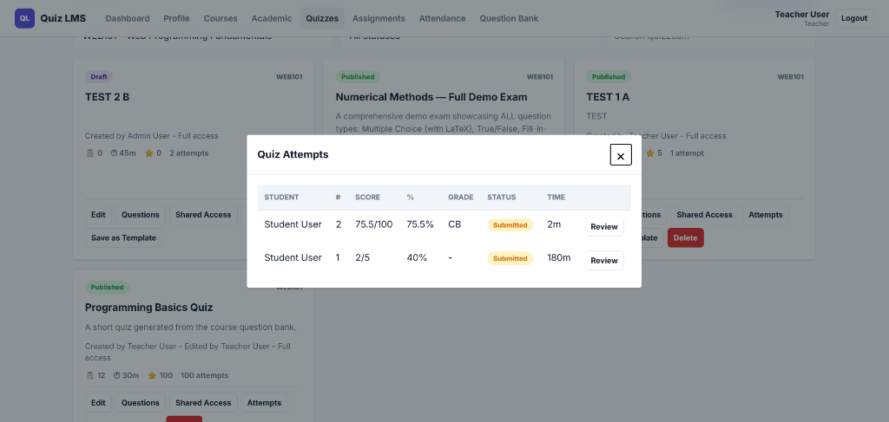 |

| Gradebook | Mobile users page |
| --- | --- |
| 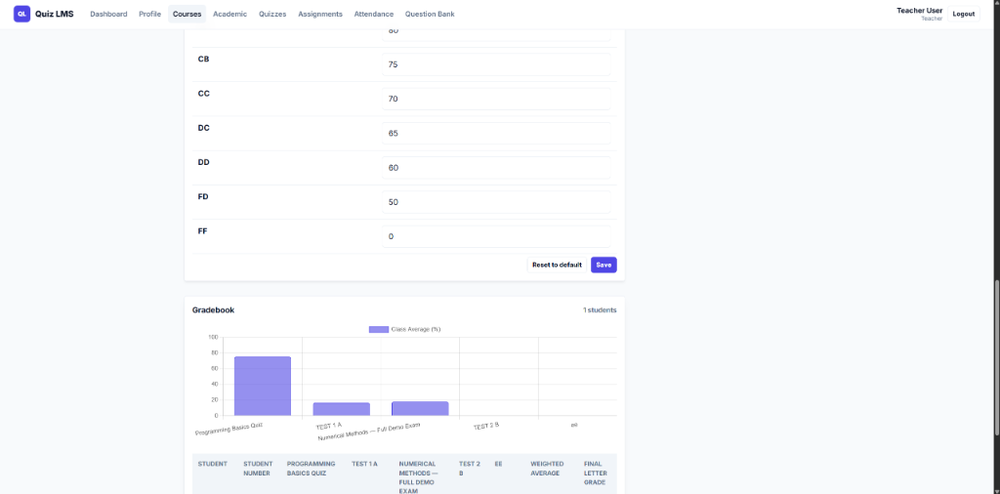 | 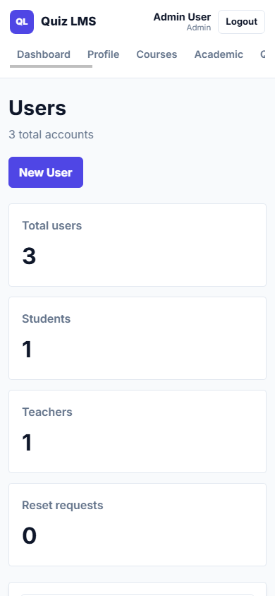 |

| Swagger API Docs | Login screen |
| --- | --- |
| 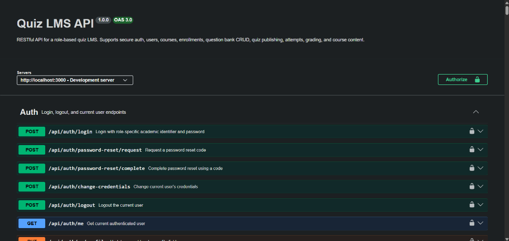 | 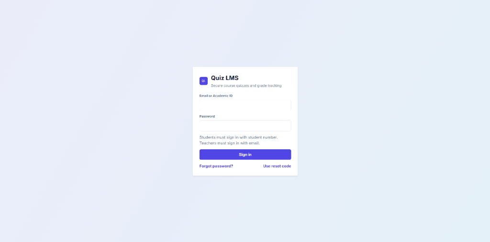 |

## First Run / Maintenance Mode

Fresh installs start in maintenance mode. Teachers and students cannot sign in until an admin disables maintenance mode.

Default admin:

- username: `admin`
- password: `Admin123!`

After first login, the default admin must change the username and password. Then open `Maintenance` from the admin navbar and turn maintenance mode off. Teacher and student logins will work after that.

Default seeded demo users:

- teacher: `teacher@example.com` / `Teacher123!`
- student: `STU-0003` / `Student123!`

## Setup

Requires Node.js `>=22.13.0` because the database layer uses `node:sqlite`.

```bash
npm ci
npm start
```

- App: `http://localhost:3000`
- API index: `http://localhost:3000/api` (admin-only)
- Swagger UI: `http://localhost:3000/api-docs` (admin-only)
- Raw OpenAPI JSON: `http://localhost:3000/api-docs.json` (admin-only)
- Health check: `http://localhost:3000/api/health`

The API index and Swagger are admin-only, so sign in as an admin first.
The public health check returns `status: "not_ok"` with HTTP `503` if the database check fails.
Admins can open the API index and API docs from the navbar; the Maintenance page also shows the current `/api/health` result.

## Environment

Development works without a `.env` file. Production should set these:

- `NODE_ENV=production`
- `PASSWORD_SPICE`: required in production for password/session hashing.
- `JWT_SECRET`: required in production for session JWT signing.
- `PORT`: optional, defaults to `3000`.
- `CORS_ORIGINS`: optional comma-separated list for non-localhost origins.

Session cookies are `HttpOnly` and `SameSite=Strict`. They use the `Secure` attribute in production so HTTPS deployments stay protected, while local `http://localhost:3000` browser testing keeps sessions across refreshes.

## Tests

```bash
npm test
npm run test:api-docs
npm run coverage
```

The main suite includes backend unit/integration tests for auth, maintenance mode, user identity rules, quiz attempts and grading, academic records, validators, route mounts, and API documentation coverage.

`npm run test:api-docs` enforces 100% API documentation coverage for every Express API method in `server.js` and `routes/*.js`. It fails when a route is missing a Swagger operation, when Swagger documents a route that no longer exists, or when the generated OpenAPI operation is missing its summary, tag, or responses.

## Main API Groups

- `/api` (admin-only index)
- `/api/health` (public health check)
- `/api/auth`
- `/api/users`
- `/api/courses`
- `/api/categories`
- `/api/questions`
- `/api/quizzes`
- `/api/academic`
- `/api/analytics`
- `/api/restrictions`
- `/api/issues`
- `/api/imports`
- `/api/discussion`
- `/api/weeks`
- `/api/audit`
- `/api/settings`

## Import Batches

Admins can upload CSV files from Admin Analytics or `POST /api/imports/batches` as `multipart/form-data` with `type` and `file`. Supported import types are `users`, `courses`, and `enrollments`; files must be `.csv` with a CSV-compatible MIME type, can be up to 100 MB, are parsed in memory, and are not stored in public upload folders.

Each row is validated independently. Valid rows are inserted, duplicate users/courses/enrollments are skipped with row errors, and invalid rows are recorded under the batch. Batch status is `pending`, `processing`, `completed`, `completed_with_errors`, or `failed`. Batch responses include `batchNumber`, importer/file metadata, `totalRows`, `createdCount`, `updatedCount`, `skippedCount`, `failedCount`, and `validationErrorCount`; `GET /api/imports/batches/{id}` returns the batch detail with recent row-level errors.

`users.csv`:

```csv
email,password,firstName,lastName,role
student1@example.com,Password123,Student,One,student
teacher1@example.com,Password123,Teacher,One,teacher
```

`courses.csv`:

```csv
code,title,description,visibility
CS101,Introduction to Computer Science,Basic CS course,published
```

`enrollments.csv`:

```csv
userEmail,courseCode
student1@example.com,CS101
```

## Architecture

```text
quiz-lms/
|-- constants/      Shared enums, limits, and issue codes
|-- database/       SQLite initialization, schema, and seed data
|-- middleware/     Auth, rate limiting, validation, and upload guards
|-- public/         Vanilla JS SPA, CSS, and client-side pages
|-- repositories/   Raw SQLite data access
|-- routes/         Thin Express route handlers and Swagger JSDoc
|-- serializers/    API response normalization
|-- services/       Business rules and academic workflows
|-- swagger/        Swagger/OpenAPI setup
|-- tests/          Jest test suites
|-- utils/          Security, validation, and error helpers
|-- validators/     Input validation modules
`-- server.js       Express app entry point
```

## Security Notes

- Passwords are stored as salted and peppered `scrypt` hashes, never plaintext.
- Session tokens are server-set cookies; the frontend does not store tokens in `localStorage`.
- Query-string, Authorization header, and custom-header session tokens are rejected.
- Maintenance mode blocks teacher/student login and revokes existing non-admin sessions when re-enabled.
- Admins bypass maintenance mode so they can finish setup and turn it off.
- Protected upload directories are not directly browsable; course, week, and submission downloads go through authenticated endpoints and are forced to download with `attachment`, `application/octet-stream`, `nosniff`, sandbox, and `noopen` headers.
- Course resource and submission uploads allow educational files: `pdf`, `txt`, `doc`, `docx`, `ppt`, `pptx`, `xls`, `xlsx`, `csv`, `png`, `jpg`, `jpeg`, `gif`, `webp`, `md`, `html`, `htm`, `rtf`, and `zip`.
- Production startup fails fast if required crypto secrets are missing.

## SEB Compatibility Note

Quiz LMS implements SEB-compatible request checks for quiz start restrictions. It does not claim full production-grade Safe Exam Browser hard security integration.

## License

MIT. See [LICENSE](LICENSE).
