# Quiz LMS

[](https://github.com/Gestusition/Quiz-LMS/actions/workflows/nodejs.yml)
Quiz LMS is a full-stack course and quiz management system. It uses a vanilla JavaScript single-page frontend, an Express REST API, and SQLite databases with a layered backend structure.

The project is intentionally backend-heavy: routes stay thin, business rules live in services, SQL lives in repositories, and tests exercise the academic workflows instead of only checking that pages render.

## Requirement Coverage

- Vanilla JavaScript SPA: `public/index.html` and `public/js/` use browser modules and `fetch`, with no React/Vue/Angular.
- Node.js + Express backend: `server.js` mounts the REST API and static SPA.
- Database-backed CRUD: SQLite stores users, courses, categories, questions, quizzes, attempts, enrollments, academic records, audit logs, settings, and more.
- REST/JSON API: endpoints use standard HTTP methods and JSON request/response bodies.
- Validation: backend validators and service checks protect academic identifiers, question formats, quiz settings, uploads, passwords, and scoped access rules.
- Modular code quality: `routes -> services -> repositories`, plus `validators`, `serializers`, `constants`, and middleware.
- Swagger: admin-only interactive API documentation is available at `http://localhost:3000/api-docs`.
- Tests: Jest covers auth, maintenance mode, quiz attempts, academic workflows, validators, rate limiting, route mounts, and LMS regressions.

## Main Features

- Role-based accounts for `admin`, `teacher`, and `student`.
- Strict academic login identifiers:
  - admins log in with `username` or `email`
  - teachers log in with `email`
  - students log in with `student_number`
- Maintenance mode for fresh installs and controlled rollout.
- Admin user management with search, filtering, pagination, duplicate protection, profile data, and password reset codes.
- Course, offering, enrollment, term, faculty, department, class year, and section management.
- Question bank with categories, difficulty, multiple question types, math/table questions, image upload, validation issues, and sharing controls.
- Quiz lifecycle with drafts, publishing, timed attempts, max attempts, result visibility policies, negative marking, manual review, templates, grade schemes, and SEB-compatible checks.
- Assignment submission and grading workflows.
- Attendance sessions, self-attendance, instructor records, record removal notes, and summaries.
- Weekly course materials, protected resource downloads, and discussion threads.
- Teacher office hours: teachers set them from Profile, and enrolled students see them on course participant lists.
- User restrictions, scoped access blocking, audit logging, real CSV import batches, and admin analytics.

## Screenshots

| Admin dashboard | Teacher dashboard |
| --- | --- |
|  |  |

| Student dashboard | Course management |
| --- | --- |
|  |  |

| Course detail | Edit quiz workflow |
| --- | --- |
|  |  |

| Question bank | Quiz taking experience |
| --- | --- |
|  |  |

| Quiz attempt review | Quiz attempts list |
| --- | --- |
|  |  |

| Gradebook | Mobile users page |
| --- | --- |
|  |  |

| Swagger API Docs | Login screen |
| --- | --- |
|  |  |

## First Run / Maintenance Mode

Fresh installs start in maintenance mode. Teachers and students cannot sign in until an admin disables maintenance mode.

Default admin:

- username: `admin`
- password: `Admin123!`

After first login, the default admin must change the username and password. This initial admin account is protected from deletion. Then open `Maintenance` from the admin navbar and turn maintenance mode off. Teacher and student logins will work after that.

Default seeded demo users:

- teacher: `teacher@example.com` / `Teacher123!`
- student: `STU-0003` / `Student123!`

## Prerequisites

- Git for cloning the repository.
- Node.js `>=22.13.0` with npm. This version is required because the database layer uses `node:sqlite`.
- A modern browser for the SPA.
- No external database server is required; SQLite files are created under `data/`.

## Setup

From the project root:

```bash
npm ci
npm start
```

- App: `http://localhost:3000`
- API index: `http://localhost:3000/api` (admin-only)
- Swagger UI: `http://localhost:3000/api-docs` (admin-only)
- Raw OpenAPI JSON: `http://localhost:3000/api-docs.json` (admin-only)
- Health check: `http://localhost:3000/api/health`

The API index and Swagger are admin-only, so sign in as an admin first.
The public health check returns `status: "not_ok"` with HTTP `503` if the database check fails.
Admins can open the API index and API docs from the navbar; the Maintenance page also shows the current `/api/health` result.

## Quick Reproduction Walkthrough

Use these steps to reproduce the running program from a fresh local checkout:

1. Clone the repository and enter the project folder.

   ```bash
   git clone https://github.com/Gestusition/Quiz-LMS.git
   cd Quiz-LMS
   ```

2. Install dependencies and start the server.

   ```bash
   npm ci
   npm start
   ```

3. Open `http://localhost:3000` and sign in with the seeded admin account: `admin` / `Admin123!`.
4. On the first admin login, change the default admin username and password when prompted.
5. Open `Maintenance` from the admin navbar and turn maintenance mode off.
6. Sign out, then sign in as the seeded teacher: `teacher@example.com` / `Teacher123!`.
7. Open `Courses`, select `DEMO101 - Demo Programming Fundamentals`, then create or inspect categories, questions, and quizzes.
8. Create a quiz as a draft, assign at least one valid question, publish it, then sign out.
9. Sign in as the seeded student: `STU-0003` / `Student123!`.
10. Open the published quiz, start an attempt, submit answers, and review the result according to the quiz result policy.
11. Optional verification: run `npm test` and `npm run test:api-docs` to reproduce the automated checks.

The first startup seeds demo users, `DEMO101 - Demo Programming Fundamentals`, categories, question banks, `Programming Basics Quiz`, and `Numerical Methods Full Demo Exam`. Seed completion is recorded in system settings, so deleting `DEMO101` or either demo quiz later will not recreate them on restart. Existing SQLite files in `data/` are reused on later runs, so use a clean checkout or remove local demo database files only if you intentionally want a fresh seed.

## Environment

Development works without a `.env` file. Production should set these:

- `NODE_ENV=production`
- `PASSWORD_SPICE`: required in production for password/session hashing.
- `JWT_SECRET`: required in production for session JWT signing.
- `PORT`: optional, defaults to `3000`.
- `CORS_ORIGINS`: optional comma-separated list for non-localhost origins.

Session cookies are `HttpOnly` and `SameSite=Strict`. They use the `Secure` attribute in production so HTTPS deployments stay protected, while local `http://localhost:3000` browser testing keeps sessions across refreshes.

## Tests

```bash
npm test
npm run test:api-docs
npm run coverage
```

The main suite includes backend unit/integration tests for auth, maintenance mode, user identity rules, quiz attempts and grading, academic records, validators, route mounts, and API documentation coverage.

`npm run test:api-docs` enforces 100% API documentation coverage for every Express API method in `server.js` and `routes/*.js`. It fails when a route is missing a Swagger operation, when Swagger documents a route that no longer exists, or when the generated OpenAPI operation is missing its summary, tag, or responses.

## Main API Groups

- `/api` (admin-only index)
- `/api/health` (public health check)
- `/api/auth`
- `/api/users`
- `/api/courses`
- `/api/categories`
- `/api/questions`
- `/api/quizzes`
- `/api/academic`
- `/api/analytics`
- `/api/restrictions`
- `/api/issues`
- `/api/imports`
- `/api/discussion`
- `/api/weeks`
- `/api/audit`
- `/api/settings`

## Example API Requests

The API uses an `auth_token` HTTP-only cookie for sessions. These examples use `curl` cookie jars (`-c` to save cookies and `-b` to send them back). Replace placeholder IDs such as `COURSE_ID`, `CATEGORY_ID`, `QUESTION_ID`, `QUIZ_ID`, and `ATTEMPT_ID` with IDs returned by earlier responses.

```bash
BASE=http://localhost:3000
```

Public health check:

```bash
curl "$BASE/api/health"
```

Example response:

```json
{
  "status": "ok",
  "database": "ok",
  "timestamp": "2026-05-18T20:00:00.000Z"
}
```

Admin login, first-run credential rotation, and maintenance disable:

```bash
curl -i -c admin-cookies.txt \
  -H "Content-Type: application/json" \
  -d '{"identifier":"admin","password":"Admin123!"}' \
  "$BASE/api/auth/login"

curl -b admin-cookies.txt \
  -H "Content-Type: application/json" \
  -d '{"username":"admin.local","currentPassword":"Admin123!","newPassword":"Admin1234!"}' \
  "$BASE/api/auth/change-credentials"

curl -b admin-cookies.txt \
  -X PUT \
  -H "Content-Type: application/json" \
  -d '{"enabled":false}' \
  "$BASE/api/settings/maintenance"
```

If the admin account has already been rotated, log in with the current admin username and password and skip the credential-rotation request.

Teacher login, course lookup, category creation, question creation, quiz creation, question assignment, and publishing:

```bash
curl -i -c teacher-cookies.txt \
  -H "Content-Type: application/json" \
  -d '{"identifier":"teacher@example.com","password":"Teacher123!"}' \
  "$BASE/api/auth/login"

curl -b teacher-cookies.txt "$BASE/api/courses"

curl -b teacher-cookies.txt \
  -H "Content-Type: application/json" \
  -d '{"courseId":COURSE_ID,"name":"API Demo","description":"Questions created through README API examples."}' \
  "$BASE/api/categories"

curl -b teacher-cookies.txt \
  -H "Content-Type: application/json" \
  -d '{"categoryId":CATEGORY_ID,"text":"HTTP is stateless.","type":"TF","correctAnswer":"true","difficulty":"EASY","points":1}' \
  "$BASE/api/questions"

curl -b teacher-cookies.txt \
  -H "Content-Type: application/json" \
  -d '{"courseId":COURSE_ID,"title":"API Demo Quiz","description":"Created from curl examples.","status":"draft","durationMinutes":20,"maxAttempts":1}' \
  "$BASE/api/quizzes"

curl -b teacher-cookies.txt \
  -X PUT \
  -H "Content-Type: application/json" \
  -d '{"questionIds":[QUESTION_ID]}' \
  "$BASE/api/quizzes/QUIZ_ID/questions"

curl -b teacher-cookies.txt \
  -X PUT \
  -H "Content-Type: application/json" \
  -d '{"status":"published"}' \
  "$BASE/api/quizzes/QUIZ_ID"
```

Example quiz response fields:

```json
{
  "id": 12,
  "courseId": 1,
  "title": "API Demo Quiz",
  "status": "published",
  "durationMinutes": 20,
  "maxAttempts": 1
}
```

Student login, attempt start, attempt submission, and attempt lookup:

```bash
curl -i -c student-cookies.txt \
  -H "Content-Type: application/json" \
  -d '{"identifier":"STU-0003","password":"Student123!"}' \
  "$BASE/api/auth/login"

curl -b student-cookies.txt \
  -X POST \
  "$BASE/api/quizzes/QUIZ_ID/attempts"

curl -b student-cookies.txt \
  -X POST \
  -H "Content-Type: application/json" \
  -d '{"answers":{"QUESTION_ID":"true"},"timeSpentSeconds":30}' \
  "$BASE/api/quizzes/attempts/ATTEMPT_ID/submit"

curl -b student-cookies.txt "$BASE/api/quizzes/attempts/ATTEMPT_ID"
```

Swagger UI at `http://localhost:3000/api-docs` contains the full request and response schema for every route.

## Import Batches

Admins can upload CSV files from Admin Analytics or `POST /api/imports/batches` as `multipart/form-data` with `type` and `file`. Supported import types are `users`, `courses`, and `enrollments`; files must be `.csv` with a CSV-compatible MIME type, can be up to 100 MB, are parsed in memory, and are not stored in public upload folders.

Each row is validated independently. Valid rows are inserted, duplicate users/courses/enrollments are skipped with row errors, and invalid rows are recorded under the batch. Batch status is `pending`, `processing`, `completed`, `completed_with_errors`, or `failed`. Batch responses include `batchNumber`, importer/file metadata, `totalRows`, `createdCount`, `updatedCount`, `skippedCount`, `failedCount`, and `validationErrorCount`; `GET /api/imports/batches/{id}` returns the batch detail with recent row-level errors.

`users.csv`:

```csv
email,password,firstName,lastName,role
student1@example.com,Password123,Student,One,student
teacher1@example.com,Password123,Teacher,One,teacher
```

`courses.csv`:

```csv
code,title,description,visibility
CS101,Introduction to Computer Science,Basic CS course,published
```

`enrollments.csv`:

```csv
userEmail,courseCode
student1@example.com,CS101
```

## Architecture

```text
quiz-lms/
|-- constants/      Shared enums, limits, and issue codes
|-- database/       SQLite initialization, schema, and seed data
|-- middleware/     Auth, rate limiting, validation, and upload guards
|-- public/         Vanilla JS SPA, CSS, and client-side pages
|-- repositories/   Raw SQLite data access
|-- routes/         Thin Express route handlers and Swagger JSDoc
|-- serializers/    API response normalization
|-- services/       Business rules and academic workflows
|-- swagger/        Swagger/OpenAPI setup
|-- tests/          Jest test suites
|-- utils/          Security, validation, and error helpers
|-- validators/     Input validation modules
`-- server.js       Express app entry point
```

## Database Architecture (ER Diagram)

The database source of truth is `database/db.js`. On startup the app opens an in-memory SQLite connection and attaches one SQLite file per context:

| Attached schema | Default file | Tables |
| --- | --- | --- |
| `users` | `data/quiz.users.sqlite` | `users`, `sessions`, `system_settings`, `password_reset_codes`, `user_restrictions`, `validation_issues`, `import_batches`, `import_errors`, `audit_logs`, `resource_access_grants` |
| `admin` | `data/quiz.admin.sqlite` | `admin_profiles` |
| `teacher` | `data/quiz.teacher.sqlite` | `teacher_profiles` |
| `student` | `data/quiz.student.sqlite` | `student_profiles` |
| `learning` | `data/quiz.learning.sqlite` | `faculties`, `departments`, `class_years`, `sections`, `academic_terms`, `courses`, `course_offerings`, `course_offering_enrollments`, `enrollments`, `categories`, `attendance_sessions`, `attendance_records`, `course_weeks` |
| `assessment` | `data/quiz.assessment.sqlite` | `questions`, `question_user_settings`, `question_parts`, `question_table_config`, `quizzes`, `quiz_questions`, `quiz_attempts`, `attempt_answers`, `assignments`, `assignment_submissions`, `grade_schemes`, `grade_thresholds`, `exam_templates` |
| `content` | `data/quiz.content.sqlite` | `announcements`, `resources`, `week_resources`, `course_threads`, `course_thread_replies` |

The diagram below uses initialized table and column names, but shows representative columns rather than every column. Relationships that cross attached SQLite contexts are logical application relationships; SQLite enforces only the foreign keys declared inside the same attached database file. Week-scoped course materials are modeled through `week_resources`; `resources.weekId` may exist on migrated or initialized databases as a legacy compatibility column, but the current application does not use it as the week-resource relationship.

```mermaid
erDiagram
    users {
        int id PK
        string name
        string username UK
        string email UK
        string role
        string status
    }
    admin_profiles {
        int id PK
        int userId FK
        int facultyId FK
        int departmentId FK
    }
    student_profiles {
        int id PK
        int userId FK
        string studentNumber
        int facultyId FK
        int departmentId FK
        int classYearId FK
        int sectionId FK
    }
    teacher_profiles {
        int id PK
        int userId FK
        string staffNumber
        int facultyId FK
        int departmentId FK
    }

    faculties {
        int id PK
        string code UK
        string name
    }
    departments {
        int id PK
        int facultyId FK
        string code
        string name
    }
    class_years {
        int id PK
        int departmentId FK
        int yearNumber
        string name
    }
    sections {
        int id PK
        int classYearId FK
        string name
    }
    academic_terms {
        int id PK
        string name
        string academicYear
        string semesterType
        int isActive
    }
    courses {
        int id PK
        string code
        string title
        int departmentId FK
        int credits
        string visibility
    }
    course_offerings {
        int id PK
        int courseId FK
        int termId FK
        int instructorId FK
        int departmentId FK
        int classYearId FK
        int sectionId FK
        string status
    }
    course_offering_enrollments {
        int id PK
        int courseOfferingId FK
        int studentId FK
        string status
        string finalGrade
    }
    enrollments {
        int id PK
        int courseId FK
        int userId FK
        string role
        string status
    }
    attendance_sessions {
        int id PK
        int courseOfferingId FK
        int termId FK
        string sessionDate
        string status
    }
    attendance_records {
        int id PK
        int sessionId FK
        int studentId FK
        string status
    }
    course_weeks {
        int id PK
        int courseId FK
        int weekNumber
        string title
        int visible
    }
    categories {
        int id PK
        int courseId FK
        string name
    }

    quizzes {
        int id PK
        int courseId FK
        string title
        string status
        int durationMinutes
        int maxAttempts
        string gradingMode
    }
    questions {
        int id PK
        int categoryId FK
        string type
        float points
        string difficulty
    }
    question_parts {
        int id PK
        int questionId FK
        string answerType
        float points
    }
    question_table_config {
        int id PK
        int questionId FK
        int rowCount
    }
    question_user_settings {
        int id PK
        int questionId FK
        int userId FK
        float points
    }
    quiz_questions {
        int id PK
        int quizId FK
        int questionId FK
        float points
        int position
    }
    quiz_attempts {
        int id PK
        int quizId FK
        int userId FK
        int attemptNumber
        string status
        float score
        float percentage
    }
    attempt_answers {
        int id PK
        int attemptId FK
        int questionId FK
        float pointsAwarded
    }
    assignments {
        int id PK
        int courseOfferingId FK
        int termId FK
        string title
        string status
    }
    assignment_submissions {
        int id PK
        int assignmentId FK
        int studentId FK
        string status
        string grade
    }
    grade_schemes {
        int id PK
        int courseId FK
        string name
        string status
        bool isDefault
    }
    grade_thresholds {
        int id PK
        int gradeSchemeId FK
        string letterGrade
        float minScore
        float maxScore
    }
    announcements {
        int id PK
        int courseId FK
        string title
    }
    resources {
        int id PK
        int courseId FK
        string title
        string type
    }
    week_resources {
        int id PK
        int weekId FK
        string title
        string type
    }
    course_threads {
        int id PK
        int courseId FK
        string title
        string status
    }
    course_thread_replies {
        int id PK
        int threadId FK
    }

    users ||--o| admin_profiles : has
    users ||--o| student_profiles : has
    users ||--o| teacher_profiles : has

    faculties ||--o{ departments : contains
    departments ||--o{ class_years : contains
    class_years ||--o{ sections : contains
    departments ||--o{ courses : offers

    courses ||--o{ course_offerings : scheduled_as
    academic_terms ||--o{ course_offerings : in
    users ||--o{ course_offerings : instructs
    departments ||--o{ course_offerings : hosts
    class_years ||--o{ course_offerings : for_year
    sections ||--o{ course_offerings : for_section

    course_offerings ||--o{ course_offering_enrollments : has
    users ||--o{ course_offering_enrollments : as_student
    courses ||--o{ enrollments : has
    users ||--o{ enrollments : as_student

    course_offerings ||--o{ attendance_sessions : has
    academic_terms ||--o{ attendance_sessions : during
    attendance_sessions ||--o{ attendance_records : contains
    users ||--o{ attendance_records : marked_for

    courses ||--o{ course_weeks : has
    courses ||--o{ categories : groups
    categories ||--o{ questions : contains
    courses ||--o{ quizzes : contains
    questions ||--o{ question_parts : has
    questions ||--o| question_table_config : has
    questions ||--o{ question_user_settings : customized_for
    quizzes ||--o{ quiz_questions : contains
    questions ||--o{ quiz_questions : added_to

    users ||--o{ quiz_attempts : makes
    quizzes ||--o{ quiz_attempts : receives
    quiz_attempts ||--o{ attempt_answers : contains
    questions ||--o{ attempt_answers : answered_in

    course_offerings ||--o{ assignments : has
    academic_terms ||--o{ assignments : during
    assignments ||--o{ assignment_submissions : receives
    users ||--o{ assignment_submissions : submits

    courses ||--o{ grade_schemes : grades_with
    grade_schemes ||--o{ grade_thresholds : defines

    courses ||--o{ announcements : publishes
    courses ||--o{ resources : provides
    course_weeks ||--o{ week_resources : has
    courses ||--o{ course_threads : discusses
    course_threads ||--o{ course_thread_replies : contains
```



## Security Notes

- Passwords are stored as salted and peppered `scrypt` hashes, never plaintext.
- Session tokens are server-set cookies; the frontend does not store tokens in `localStorage`.
- Query-string, Authorization header, and custom-header session tokens are rejected.
- Maintenance mode blocks teacher/student login and revokes existing non-admin sessions when re-enabled.
- Admins bypass maintenance mode so they can finish setup and turn it off.
- Protected upload directories are not directly browsable; course, week, and submission downloads go through authenticated endpoints and are forced to download with `attachment`, `application/octet-stream`, `nosniff`, sandbox, and `noopen` headers.
- Course resource and submission uploads allow educational files: `pdf`, `txt`, `doc`, `docx`, `ppt`, `pptx`, `xls`, `xlsx`, `csv`, `png`, `jpg`, `jpeg`, `gif`, `webp`, `md`, `html`, `htm`, `rtf`, and `zip`.
- Production startup fails fast if required crypto secrets are missing.

## SEB Compatibility Note

Quiz LMS implements SEB-compatible request checks for quiz start restrictions. It does not claim full production-grade Safe Exam Browser hard security integration.

## License

MIT. See [LICENSE](LICENSE).
