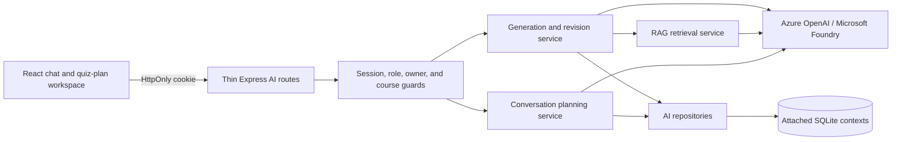
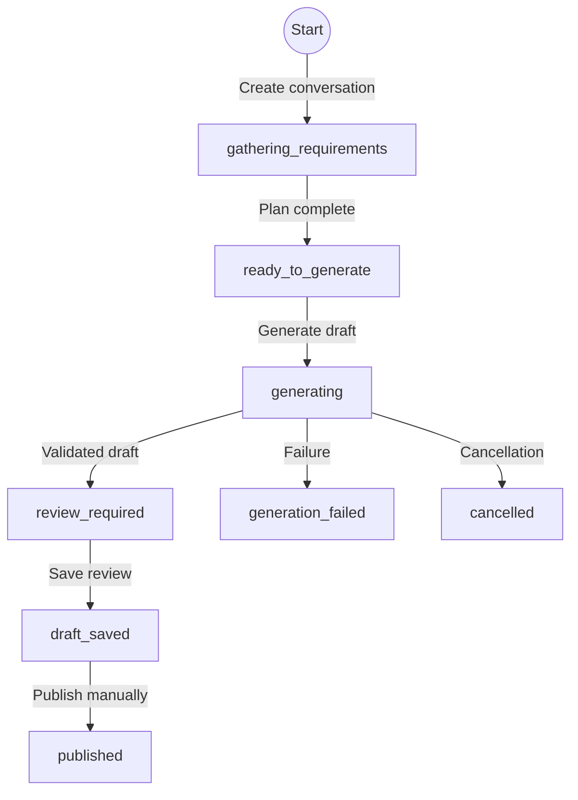

# Conversational AI Quiz Assistant

## Purpose and boundaries

The AI Assistant is a teacher/admin workspace for planning, generating, reviewing, and revising quiz drafts. It is intentionally separated into two stages:

1. **Planning** turns teacher messages and advanced controls into one validated `quizPlan`.
2. **Generation** runs only after an explicit Generate Draft action and always creates a draft.

The assistant never publishes a quiz. Publishing remains a separate, manual LMS action after review. Students cannot use the assistant, Azure requests never run in the browser, and saved Azure keys are never returned by an API.

The existing `/api/courses/{courseId}/ai/*` draft workflow remains available during the incremental migration. New clients should use the conversation contract described below.

## Architecture



Routes authenticate and normalize request identifiers, then delegate business decisions to services. Services validate authorization again where a conversation, material, generation run, revision, or draft is loaded. Repositories contain parameterized SQL and expose transactions for multi-record state changes.

The route is an incremental frontend island: the existing vanilla SPA loads the Vite-built module only for `#/ai-quiz`, passes its existing API/session adapter into `mountAiAssistant`, and unmounts React on navigation. If the built module is unavailable, the original AI Assistant page is opened instead. Other LMS routes remain unchanged.

Course selection is a first-class onboarding step in Chat, Quiz Plan, and Course Materials. Selecting a course creates a course-scoped conversation directly (or patches an existing course-less conversation) without requiring Azure configuration or a chat request. Course loading, failure, and genuinely empty authorization states are shown separately.

Suggestion chips are live workspace state rather than fixed examples. They appear after a course is selected, then the server recomputes them from the canonical quiz plan, course name, exact question-type distribution, recent teacher direction, draft state, selected material filenames, and safe themes extracted from bounded course-material excerpts. Uploading, pasting, removing, or selecting material refreshes the suggestions without exposing raw file content.

Persisted state is split by context:

- `users.ai_user_settings` stores each user's encrypted Azure configuration.
- `learning.ai_course_materials` and `learning.ai_material_chunks` store course-scoped RAG inputs.
- `assessment.ai_conversations`, `ai_messages`, and `ai_quiz_plans` store the chat workspace.
- `assessment.ai_generation_runs`, `ai_generation_sources`, `ai_quiz_drafts`, and `ai_draft_revisions` store idempotent execution, provenance, review drafts, and audit history.

## Quiz-plan contract

Chat and advanced settings edit the same persisted object; the browser must not keep a second authoritative copy.

```json
{
  "courseId": 1,
  "topic": "Python loops",
  "learningObjectives": [
    "Trace for and while loops",
    "Recognize nested-loop behavior"
  ],
  "difficulty": "medium",
  "questionCount": 8,
  "language": "English",
  "questionTypeDistribution": {
    "multipleChoice": 6,
    "trueFalse": 0,
    "shortAnswer": 0,
    "essay": 0,
    "coding": 2
  },
  "materialMode": "course_material_preferred",
  "useIndexedMaterialOnly": false,
  "includeExplanations": true,
  "timeLimitMinutes": 20,
  "tags": ["loops", "week-4"],
  "gradingPreferences": "",
  "specialInstructions": "",
  "missingRequiredFields": [],
  "readinessStatus": "ready_to_generate"
}
```

The server recomputes `missingRequiredFields` and `readinessStatus`; it does not trust values supplied by the browser. A planning response contains a concise assistant message, validated plan updates, missing information, suggested replies, and a readiness flag. Model output is parsed as strict structured data without requesting or storing chain-of-thought.

Conversation statuses are:

- `gathering_requirements`
- `ready_to_generate`
- `generating`
- `generation_failed`
- `review_required`
- `draft_saved`
- `published`

Generation-run statuses are:

- `queued`
- `generating`
- `completed`
- `failed`
- `cancel_requested`
- `cancelled`

`published` records a later manual LMS event; it is never the result of the generation endpoint.

Quiz-plan readiness itself has only two values: `gathering_requirements` and `ready_to_generate`. The longer status list above belongs to the conversation lifecycle.

## HTTP contract

All operations require the `auth_token` HttpOnly cookie and a current teacher/admin role.

| Method | Path | Purpose |
| --- | --- | --- |
| `GET` | `/api/ai/settings/status` | Read masked configuration status and the conversational API contract version |
| `POST` | `/api/ai/settings` | Save private Azure settings for the current user |
| `POST` | `/api/ai/settings/test` | Test chat and embedding deployments independently |
| `POST` | `/api/ai/conversations` | Create an owned conversation and initial assistant greeting |
| `GET` | `/api/ai/conversations` | List conversations visible to the current owner |
| `GET` | `/api/ai/conversations/{id}` | Read messages, plan, draft link, and revision summaries |
| `POST` | `/api/ai/conversations/{id}/messages` | Add a teacher message and receive a validated planning update |
| `PATCH` | `/api/ai/conversations/{id}/plan` | Update advanced settings and recompute readiness |
| `POST` | `/api/ai/conversations/{id}/generate` | Generate one draft using an `Idempotency-Key` header |
| `GET` | `/api/ai/conversations/{id}/generation-status` | Read real generation stage/status |
| `POST` | `/api/ai/conversations/{id}/cancel` | Request cancellation when technically possible |
| `POST` | `/api/ai/conversations/{id}/revise` | Create a controlled revision preview |
| `POST` | `/api/ai/conversations/{id}/revisions/{revisionId}/apply` | Apply an owned pending preview |
| `POST` | `/api/ai/conversations/{id}/regenerate-questions` | Regenerate selected zero-based question indexes |
| `PUT` | `/api/ai/conversations/{id}/draft` | Save validated manual review edits |
| `POST` | `/api/courses/{courseId}/ai/materials` | Upload and index one PDF, TXT, Markdown, or DOCX file |
| `GET` | `/api/courses/{courseId}/ai/materials` | List indexed materials for an authorized course |
| `POST` | `/api/courses/{courseId}/ai/materials/paste` | Index pasted text as course material |
| `DELETE` | `/api/courses/{courseId}/ai/materials/{materialId}` | Remove an authorized material and its chunks |
| `GET` | `/api/courses/{courseId}/ai/source-chunks/{chunkId}` | Inspect one authorized source excerpt |

The Generate Draft operation requires an `Idempotency-Key` containing 8–128 URL-safe characters (`A-Z`, `a-z`, `0-9`, `.`, `_`, `:`, or `-`, beginning with an alphanumeric character). Keys are scoped to one conversation. Repeating the same key for that conversation returns the existing generation run or result and does not create another draft.

`GET /api/ai/settings/status` always returns `conversationApiVersion`. The frontend refuses to show a false empty state when the running Express process is older than the browser bundle; it instead asks the operator to restart the server, offers a contract recheck, and retains the existing assistant as a fallback.

## Lifecycle



Retry and backward transitions are listed separately to keep the diagram readable:

| Current state | Event | Next state |
| --- | --- | --- |
| `ready_to_generate` | A required field is removed | `gathering_requirements` |
| `generation_failed` | Retry without losing the plan | `ready_to_generate` |
| `draft_saved` | Continue editing | `review_required` |

Messages and plan patches can leave a conversation in `gathering_requirements`. Edits and revision previews can likewise leave a draft in `review_required` until it is explicitly saved.

Generation progress uses named stages rather than fabricated percentages:

1. Validating quiz plan
2. Retrieving course material
3. Selecting source passages
4. Generating questions
5. Validating generated output
6. Saving draft
7. Opening review

Failed generation preserves the conversation and plan. Draft, generation-run, source-link, and first revision records are saved in one transaction. Malformed questions are never saved as a normal draft.

## RAG and untrusted material

PDF, TXT, Markdown, DOCX, and pasted text are treated as untrusted reference data.

- Every material and chunk is bound to one course.
- Retrieval always filters by the authorized conversation course before ranking.
- Returned question source IDs are accepted only if they belong to the retrieved allow-list.
- Source links store chunk identifiers; review responses expose a human-readable label and a bounded excerpt.
- Text inside a document cannot override system, authorization, output-schema, or material-scope rules.
- `course_material_only` rejects unsupported questions instead of silently using general knowledge.
- Deleting a material removes its chunks and prevents future retrieval while preserving auditable historical metadata where required.

File extension, declared MIME type, signature, compressed-document safety, raw byte size, parsed character count, chunk count, retrieved chunk count, and provider output size are all validated independently.

## Authorization and privacy

Authorization is enforced for every resource load:

- Students receive `403`.
- Teachers and admins must satisfy the existing management policy for the selected course.
- A teacher or admin can read and mutate only their own private conversations, generation runs, and revisions.
- Course-manager access alone does not grant access to another teacher's conversation.
- The admin role does not bypass private-conversation ownership.
- Conversation course IDs, owner IDs, roles, draft IDs, material IDs, source IDs, and revision IDs are resolved from persisted records rather than trusted from the browser.
- Material-derived suggestions use only bounded, course-scoped excerpts. They discard markup, URLs, instruction-like text, and prompt-injection phrases before producing short labels; raw excerpts are never returned in suggestion payloads.
- Cross-owner resources should normally return `404` to avoid enumeration.

## Azure credential handling

Supported private settings are endpoint, API key, chat deployment, embedding deployment, and API version.

- Keys are encrypted at rest and used only on the server.
- Status and test responses never contain a saved key, request header, raw provider body, or provider stack trace.
- Chat and embedding deployments are tested separately.
- Authentication failures are not retried.
- Transient retry count is bounded and uses backoff.
- Every provider request has a timeout and cancellation signal.
- Logs use a redacted error summary and must never serialize request headers or configuration objects.

Environment alternatives use placeholder-only values:

```text
AI_QUIZ_ENABLED
AZURE_OPENAI_ENDPOINT
AZURE_OPENAI_API_KEY
AZURE_OPENAI_CHAT_DEPLOYMENT
AZURE_OPENAI_EMBEDDING_DEPLOYMENT
AZURE_OPENAI_API_VERSION
AI_CREDENTIALS_ENCRYPTION_KEY
```

## Security limits

Limits are centralized and validated before expensive parsing or provider calls. The exact values may be tightened without changing the API shape.

| Input/resource | Required control |
| --- | --- |
| Chat message | Bounded characters; NUL, stored script, and unsafe object keys rejected |
| Conversation | Bounded message count and pagination |
| Quiz plan | Bounded topics, objectives, instructions, tags, and 1–20 questions |
| Material upload | One allow-listed file, bounded raw bytes and parsed characters |
| Pasted material | Bounded title/content and normalized plain text |
| Retrieval | Course filter plus bounded candidate and selected chunk counts |
| AI output | Bounded tokens/characters and strict schema validation |
| Generation | Per-user rate limit, per-conversation lock, idempotency key |
| Revision | Owned draft/revision, bounded selected questions, preview for large changes |

Oversized JSON requests return a safe `413`; rejected material files and other validation errors return `400`; active-generation or plan-version conflicts return `409`; rate limits return `429` with `Retry-After`. Internal errors return a generic response and are logged only after credential redaction.

## Automated verification

Normal tests mock `global.fetch`; no test requires Azure credentials.

```bash
npm test
npm run test:api-docs
npm run verify:ai
npm run coverage
```

Key suites:

- `tests/aiConversationAssistant.test.js`: role, owner/course isolation, planning/readiness, generation idempotency, draft-only behavior, failure preservation, material/source isolation, revisions, regeneration, and credential redaction.
- `tests/aiQuizAssistant.test.js`: compatibility coverage for the original AI draft workflow.
- `tests/swaggerCoverage.test.js`: exact Express/OpenAPI parity, including both AI routers.
- `tests/databaseMigration.test.js`: startup migration and old-schema preservation.
- `tests/rateLimit.test.js` and `tests/uploadMiddleware.test.js`: security middleware boundaries.

`npm run verify:ai` runs TypeScript checking, the Vitest/jsdom component suite, and the Vite production build. The current frontend tests cover the greeting and composer, chat/plan synchronization, advanced-control readiness, save-before-regenerate review behavior, and keyboard-operable responsive workspace tabs. No test requires live Azure credentials.

For focused frontend development:

```bash
npm run dev
npm run dev:ai
npm run typecheck:ai
npm run test:ai
npm run build:ai
```

`npm run dev` watches and restarts Express when the AI API contract changes. `npm start` intentionally does not watch files, so it must be restarted after backend route changes. Run `npm run dev:ai` in a second terminal to rebuild the browser bundle.

The production build writes `ai-assistant.js`, `ai-assistant.css`, and the source map to `public/ai-assistant/`; Express serves those assets with the existing SPA.
